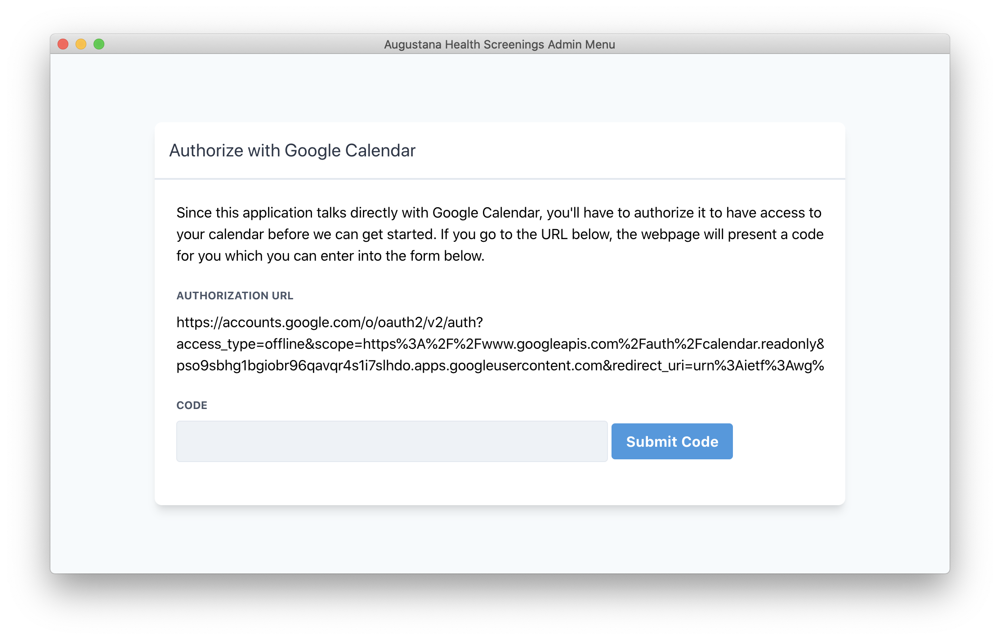
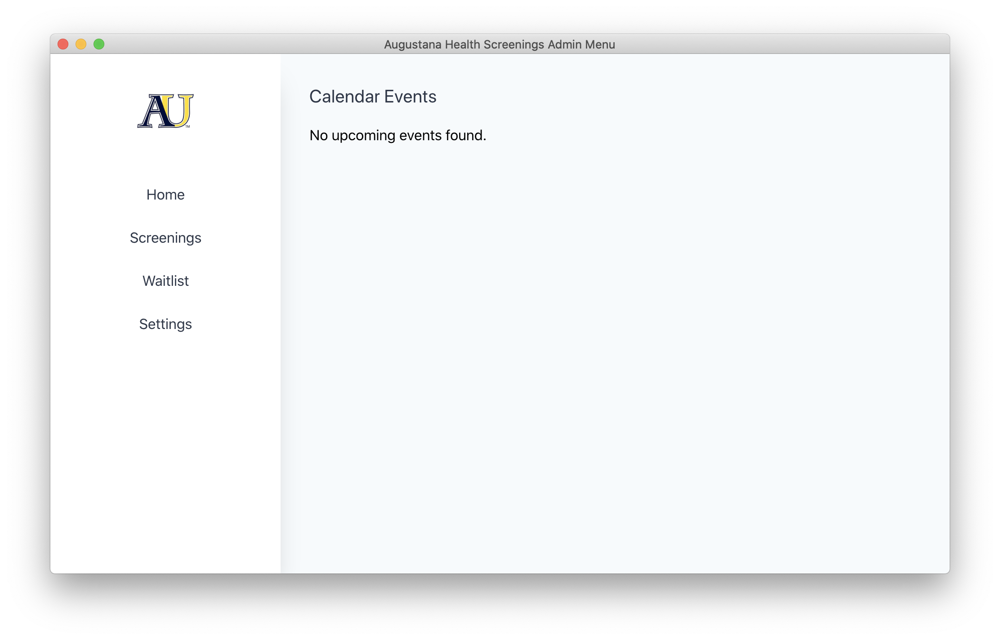

# Augustana Health Admin Menu

[](https://travis-ci.com/eugenetriguba/health-screenings-admin-menu)
[](https://codecov.io/gh/eugenetriguba/health-screenings-admin-menu)

A desktop application that integrates with Google Calendar to allow the admin to manage the data from screening appointments.





# Quick start

Make sure you have [Node.js](https://nodejs.org) installed, then type the following.
```
git clone https://github.com/eugenetriguba/augie-health-admin-menu.git
cd augie-health-admin-menu
npm install
npm start
```

You'll also want to make sure you have the [Google Calendar API](https://developers.google.com/calendar/quickstart/nodejs) enabled, and place the credentials.json you receive in the ```config/``` directory in order for the API calls for work.

# Development

For development, there is a pre-commit pipeline that will run all the tests and format the files changed to a 
consist code style before the commit is made.

## Starting the app

```
npm start
```

## The build pipeline

Build process uses [Webpack](https://webpack.js.org/). Entry-points are set for each page in the application, as well as the main process (called "background.js"). Webpack will follow all `import` statements starting from those files and compile code of the whole dependency tree into one `.js` file for each entry point.

[Babel](http://babeljs.io/) is also utilised, but mainly for its great error messages. Electron under the hood runs latest Chromium, hence most of the new JavaScript features are already natively supported.

## Environments

Environmental variables are done in a bit different way (not via `process.env`). Env files are plain JSONs in `config` directory, and build process dynamically links one of them as an `env` module. You can import it wherever in code you need access to the environment.
```js
import env from "env";
console.log(env.name);
```

## Upgrading Electron version

To do so edit `package.json`:
```json
"devDependencies": {
  "electron": "2.0.2"
}
```
*Side note:* [Electron authors recommend](http://electron.atom.io/docs/tutorial/electron-versioning/) to use fixed version here.

## Adding npm modules to your app

Remember to respect the split between `dependencies` and `devDependencies` in `package.json` file. Your distributable app will contain modules listed in `dependencies` after running the release script.

*Side note:* If the module you want to use in your app is a native one (not pure JavaScript but compiled binary) you should first  run `npm install name_of_npm_module` and then `npm run postinstall` to rebuild the module for Electron. You need to do this once after you're first time installing the module. Later on, the postinstall script will fire automatically with every `npm install`.

# Testing

Run all tests:
```
npm test
```

## Unit

```
npm run unit
```
Using [electron-mocha](https://github.com/jprichardson/electron-mocha) test runner with the [Chai](http://chaijs.com/api/assert/) assertion library. You should put your spec files in the `tests/unit` directory, just name them with the `.spec.js` extension.

## End to end

```
npm run e2e
```
Using [Mocha](https://mochajs.org/) and [Spectron](http://electron.atom.io/spectron/). This task will run all files in `tests/e2e` directory with `.e2e.js` extension.

## Database
This application uses the Sequelize ORM. You may want to install the [sequelize-cli](https://sequelize.readthedocs.io/en/latest/docs/migrations/) globally.
```
npm install -g sequelize-cli
```

Then migrate the database.
```
sequelize db:migrate
```

# Making a release

To package your app into an installer use command:
```
npm run release
```

Once the packaging process finished, the `dist` directory will contain your distributable file.

[electron-builder](https://github.com/electron-userland/electron-builder) is used to handle the packaging process. It has a lot of [customization options](https://www.electron.build/configuration/configuration), which you can declare under `"build"` key in `package.json`.

You can package your app cross-platform from a single operating system, [electron-builder kind of supports this](https://www.electron.build/multi-platform-build), but there are limitations and asterisks.
